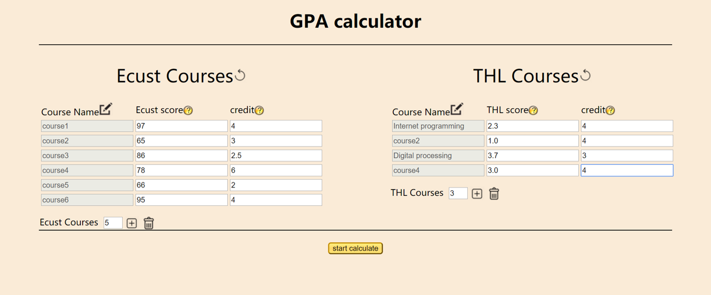
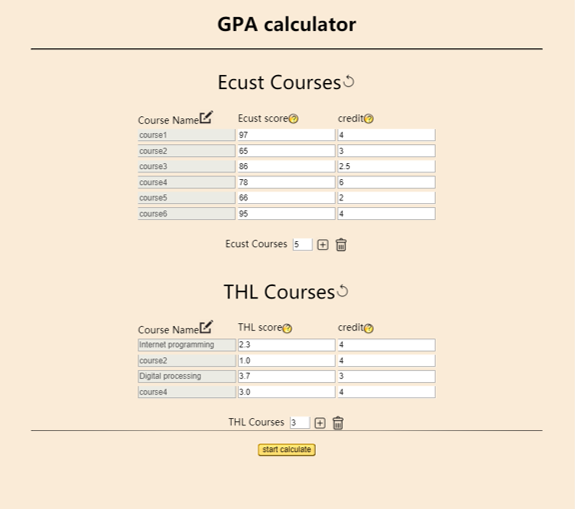
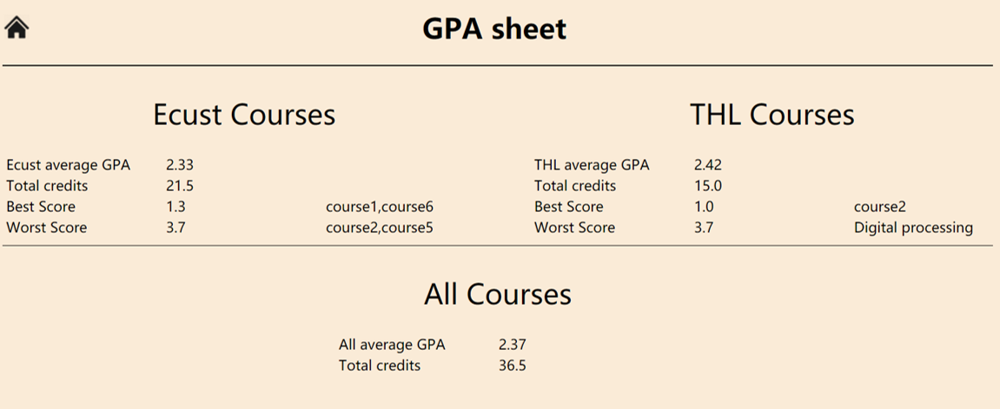

# A simple GPA calculator

>This GPA caculator can be used by all the students from Ecust students who are looking for master degree in Germany

<b>Author: Chen Sihan<b>

## function

1. caculate average GPA in each Ecust and Technische Hochschule Luebeck(THL)

2. caculate overall GPA

3. find best scores and worst scores for each period of study

4. calculate overall credits of each Ecust and THL

## features

1. input by hand, add and remove rows easily and flexibly

2. check empty and invalid input, the error will be shown with red error message where the problem is, and when users notice and click there, the error message will disappear automatically for input again

3. detail information to get users know the input format

4. users can name courses by hand, or courses will be automatically named when adding courses( e.g. course4)

5. responsive design

6. reset function for either Ecust or THL scores

7. input in Ecust scores like "98" or "60" will be converted into German GPA "1.0" or "4.0" with the standard

8. special input in Ecust scores like "A" or "A-" will be converted into German GPA "1.0" and "1.3" with the standard

> Example

- an example

- Responsive design

- Result

> Notice

Local file can only be read with Chrome, but you can view this file on my git pages with Chrome and IE and Safari:

<a href="https://spycsh.github.io/SinoGerman_EcustAndChina/">https://spycsh.github.io/SinoGerman_EcustAndChina/</a>

~Thank you for viewing!